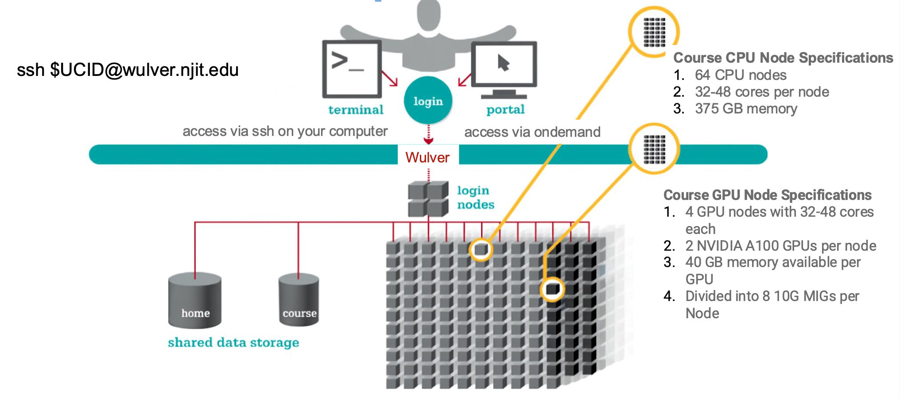

# Course Resource Configuration

## Overview

Before submitting a job on Wulver, it’s important to understand how resources such as **cores**, **memory**, and **GPUs** are allocated for course users.  
Each job’s runtime and Service Unit (SU) charge depend on how many nodes and resources are requested.

{ width=80% }

## Partition (Use `--partition`)

Course-related jobs must be submitted to one of the **course partitions** listed below:

| Partition | Nodes | Cores per Node | GPU | Memory per Node | SU Charge per Hour |
|------------|:------:|:------------:|:----:|:---------:|:-----------|
| <code>--&#8203;partition&#8203;=&#8203;course</code> | 64 | 32–48 | NA | 375 GB | `MAX(CPUs, Memory/4G) SU` |
| <code>--&#8203;partition&#8203;=&#8203;course_gpu</code> | 4 | 32–48 | A100 10G MIG | 375 GB | `2 + MAX(CPUs, Memory/4G) SU` |

Courses that require GPU computing are assigned **NVIDIA A100 10G MIG** units for GPU-enabled coursework.

## Service Units

Each user is allocated **2500 Service Units (SUs)** in their account for the duration of their course.  
SUs are consumed based on how many cores, memory, and GPUs your job requests and how long it runs.

#### SU Calculation Examples

**Example 1 – CPU-only job** <br>
20 cores for 8 hours (no `--mem` specified, so default 4G per core will be allocated) 
```
SU = MAX(CPUs, Memory/4G) x Hours 
SU = (20, 4/4) × 8 = 160  
```

**Example 2 – GPU job**  <br>
20 cores + 1 GPU for 8 hours with `--mem=128G` <br>
```
SU = [2 + MAX(CPUs, Memory/4G)] x Hours 
SU = [2 + MAX(20, 128/4)] × 8 
SU = (2 + 32) × 8 = 34 × 8 = 272
```

*To make the most of your SUs, avoid overestimating cores or memory. Over-allocation wastes SUs and delays scheduling.*

Please visit [here](../Running_jobs/service-units.md) for more info on Service Units

## Account

Every course is assigned a dedicated **account** for SU billing.  
You must specify this account in all SLURM job scripts using the `--account` flag.

Account Format
```bash
<semester>-<course>-<instructor_ucid>-<student_ucid>
```

For example:
```bash
#SBATCH --account=2025-fall-ds-492-kjc59-ls565

# 2025-fall → Semester
# ds-492 → Course code
# kjc59 → Instructor’s UCID
# ls565 → Student’s UCID
```

!!! note
    Each user’s specific account information will be emailed to them when HPC resources for that course is allocated. You can also view all accounts assigned to you using the `quota_info` command.

#### Important Notes:
- Your UCID and password are used to log in to the cluster.
- Your account name is used for SU tracking and billing.
- If you are enrolled in multiple courses or research projects, ensure that you submit jobs using the correct account to avoid suspension or access issues.
- Use the `quota_info` command to view all accounts assigned to you.


## Priority (Use `--qos`)

All course-related jobs must include the `--qos=course` flag.  
This ensures fair scheduling and appropriate priority for classwork jobs.

| Qos | Purpose | Wall time limit (hours) | Valid Users | 
|------------|:------|:----|:---------|
| <code>--&#8203;qos&#8203;=&#8203;course</code> | For all course-related jobs | 72 | Course users only |

Example:
```bash
#SBATCH --qos=course
```

## Course Directory

Each student is assigned a dedicated **course directory**, and **all work must be done inside it**, including job scripts and outputs.

Directory Format
```bash
/course/<year>/<semester>/<course>/<instructor_ucid>/<student_ucid>
```

Example:
```bash
/course/2025/fall/ds/492/kjc59/ls565
```

To switch to your course directory after logging in:
```bash
cd /course/2025/fall/ds/492/kjc59/ls565
```

Or add it to your `.bash_profile` for automatic navigation:
```bash
echo 'cd /course/2025/fall/ds/492/kjc59/ls565' >> ~/.bash_profile
```

!!! note
    Your specific course directory path will also be emailed to you along with account information when resources are allocated.