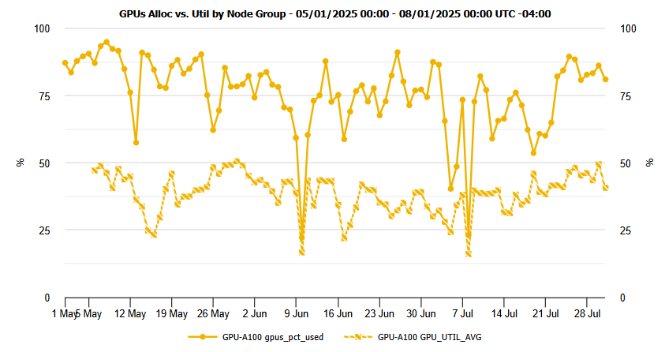

# MIG Overview

MIG (Multi-Instance GPU) is a technology introduced by NVIDIA starting with its Ampere architecture (e.g., A100). It enables a single physical GPU to be partitioned into multiple smaller, isolated GPU instances — each with dedicated compute cores, memory, cache, and bandwidth. These instances function independently and appear to software as discrete GPUs.

This allows multiple users or processes to simultaneously run GPU workloads without interfering with one another, improving resource utilization, reducing wait times in job queues, and increasing throughput in shared computing environments like Wulver.

## Why MIG on Wulver

<!-- Using HTML to display images side by side -->

    
    

The plots below show cluster-wide usage of the A100 GPUs over the last 3 months. In short: GPUs were **heavily allocated** but **lightly utilized**, which means lots of capacity sat idle behind single jobs.

- **Allocated vs. used**: GPUs were reserved ~85–95% of the time, while average compute utilization was ~25–50% and memory utilization stayed mostly under 20%.

- **Impact**: Long queue times and poor overall throughput when full GPUs are booked for workloads that only need a fraction of the device.

- **MIG rationale**: Partitioning A100s into 10/20/40 GB slices lets multiple right-sized jobs run concurrently, improving SU efficiency and time-to-results without requiring more hardware.

## MIG Implementation in Wulver

MIG is implemented on selected NVIDIA A100 80GB GPUs. Wulver currently supports the following MIG configurations:

- 10gb
- 20gb
- 40gb
- Full 80GB (non-MIG)

These profiles correspond to different partitions of compute and memory resources from the A100 80GB GPU. You can view a full comparison in the [Profile Comparison section](../MIG/profile-comparison.md).

Each profile maps to a Service Unit (SU) usage factor that reflects its computational weight — ranging from 2 SU/hour for a 10gb instance up to 16 SU/hour for a full GPU. You can check full SU overview of MIG [here](../MIG/job-submission-and-su-charges.md#understanding-su-charges)

MIGs address key challenges in shared environments:

- **Fair resource sharing**: MIG enables multiple users to share a single GPU without stepping on each other’s performance.

- **Right-sizing workloads**: Users can request GPU capacity that matches their actual workload requirements.

- **Improved scheduling efficiency**: MIG instances are smaller and easier to schedule than full GPUs.

- **Reduced idle time**: MIG reduces GPU underutilization by splitting large resources into usable chunks.

## Why You Should Use MIG Instances

**Lower SU Cost for Smaller Workloads**:  
MIG lets you select a GPU slice that meets your job’s needs without paying for more power than you use.
For example:

- A small training job or inference script may only require `10–20` GB of GPU memory.
- Running such a job on a `1g.10gb` or `2g.20gb` MIG instance will consume only a fraction of the SUs compared to using a full GPU.

This is especially important if you’re working within a research group’s annual SU allocation on Wulver.

**No Need to Reserve a Full GPU**:  
Some jobs — like unit testing, data preprocessing with GPU acceleration, or light model inference — simply don’t need the full resources of an 80GB A100. MIG allows users to avoid bottlenecks and free up resources by choosing an appropriately sized instance.This is especially valuable when:

- Cluster demand is high
- Your jobs don’t need massive memory or compute
- You're trying to run multiple parallel tasks independently

This is especially important if you’re working within a research group’s annual SU allocation on Wulver.

**Isolated and Predictable Performance**:  
Each MIG instance has dedicated resources — memory, L2 cache, compute cores — and is logically isolated from others on the same GPU. That means:

- No performance interference from noisy neighbors
- Consistent and reliable job behavior
- Easier debugging and performance tuning

MIG is compatible with CUDA, cuDNN, PyTorch, TensorFlow, and most GPU-accelerated libraries — no code changes are typically required.

!!! Note
    MIG is not implemented on all GPUs in Wulver. 