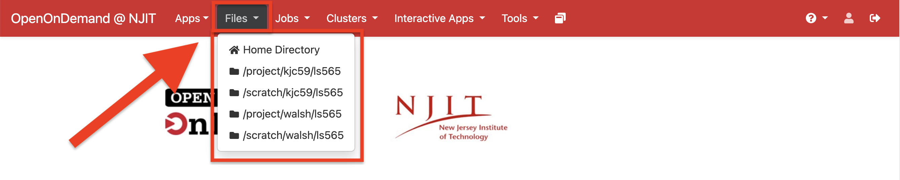

# Files
## Overview

Files provide you UI based access to your `/home`, `/project` and `/scratch` directory. 

{ width=80% height=80%}

## Guide

{ width=60% height=60%}

The File Manager tool is available under <kbd>Files</kbd> from the Dashboard. Here you can view, edit, and transfer files between your local computer and the cluster. You can access any of the shared filesystems on Wulver including your `$HOME` directory as well as Project, Research, and Scratch. This graphical interface makes it easy to navigate your directories and transfer files to the cluster. (This transfer is only for small files such as job scripts or input scripts, please use command line tools, such as [rsync](https://linux.die.net/man/1/rsync) for larger datasets).

Use the <kbd>Upload</kbd> and <kbd>Download</kbd> buttons to transfer files between your local computer and the cluster. You can navigate to any of your directories through the <kbd>Change Directory</kbd> button where you can enter the path for your desired location. You can also create new folders with the <kbd>New Directory</kbd> button.

<iframe src="https://njit.hosted.panopto.com/Panopto/Pages/Embed.aspx?id=0637a8c7-3500-47e0-91ea-b24b003bca51&autoplay=false&offerviewer=true&showtitle=true&showbrand=true&captions=true&interactivity=all" height="405" width="720" style="border: 1px solid #464646;" allowfullscreen allow="autoplay" aria-label="Panopto Embedded Video Player" aria-description="On-demand Filetransfer Demo" ></iframe>
