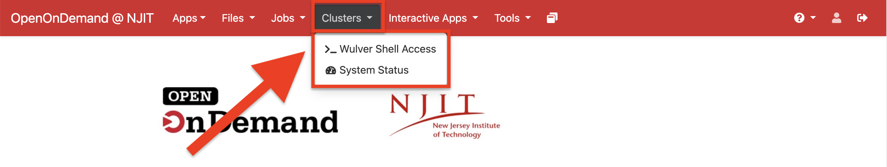
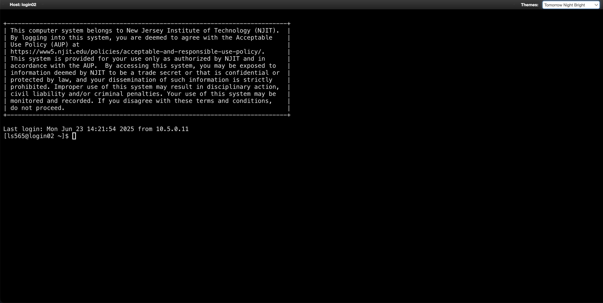
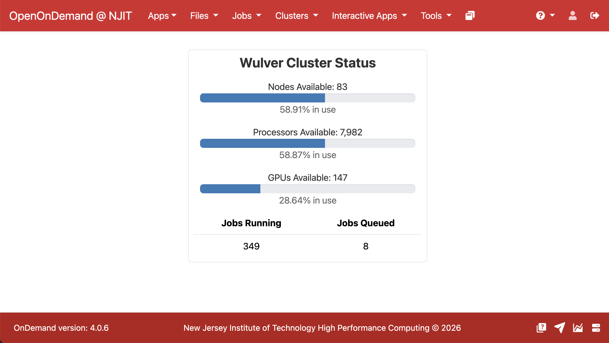

# Clusters
## Overview

The Clusters section provides browser-based access to the Wulver cluster along with real-time information about its current usage.

{ width=100% height=100%}

### Web Shell Access

Web shell access provides a command-line interface to the Wulver cluster directly through your browser. The web shell functions like a standard terminal session on a login node, allowing users to run commands, submit and monitor jobs, and manage files without requiring a local SSH client.

{ width=100% height=100%}

!!! Tip
    If you are on Windows or do not have access to a local terminal or SSH client, the web shell provides a convenient alternative with no additional setup required.

### System Status

The System Status page provides a real-time snapshot of the Wulver cluster’s current state. It displays overall availability and utilization of compute nodes, processors, and GPUs, along with the number of running and queued jobs. This view is useful for quickly assessing cluster load before submitting jobs or troubleshooting scheduling delays.

{ width=100% height=100%}
