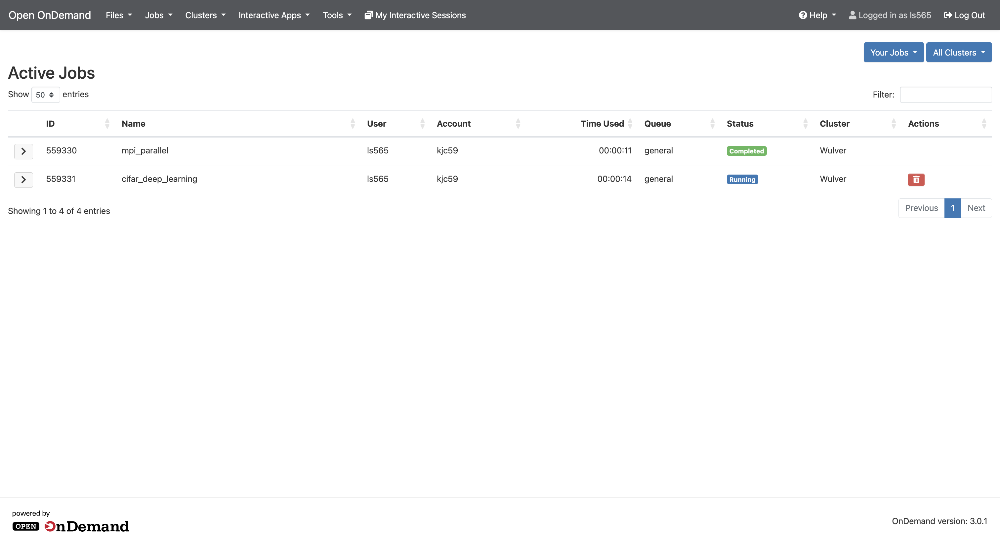
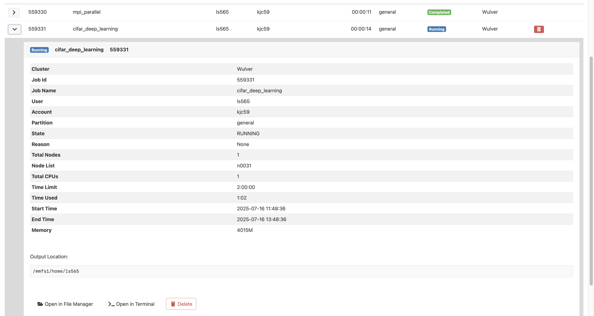

# Jobs
## Overview

The Jobs menu on the menu bar includes Open Composer, Job Composer, and Active Jobs tools.

- [Open Composer](open_composer.md) allows users to create and submit custom Slurm jobs by selecting job parameters and editing the job script directly in the browser. It is intended for users who want quick, flexible control over their job scripts.

- [Job Composer](job_composer.md) assists users in setting up and submitting jobs through a graphical interface with file management tools and access to job templates.

- [Active Jobs](#active-jobs) displays currently running or queued jobs and their status. You can monitor, cancel, or manage your jobs from this interface.

{ width=100% height=100%}

## Active Jobs

The Active Jobs tool will allow you to view all the jobs you’ve submitted that are currently in the queue, via OnDemand or not, so you can check on their status.  

{ width=100% height=100%}

You can expand each job to check more details. You can also open the current working directory of job in file manager or terminal by clicking `Open in File Manger` or `Open in Terminal` respectively.

{ width=100% height=100%}

