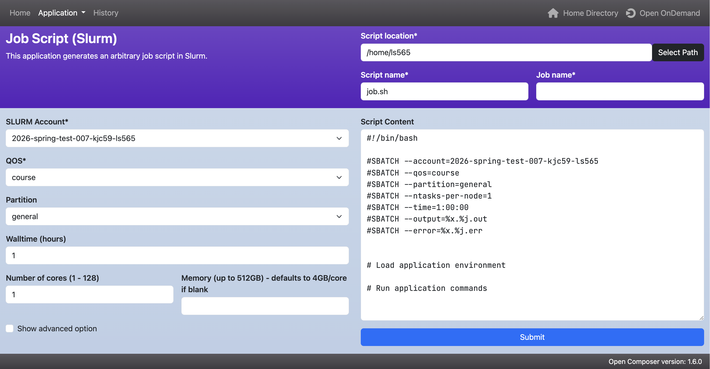
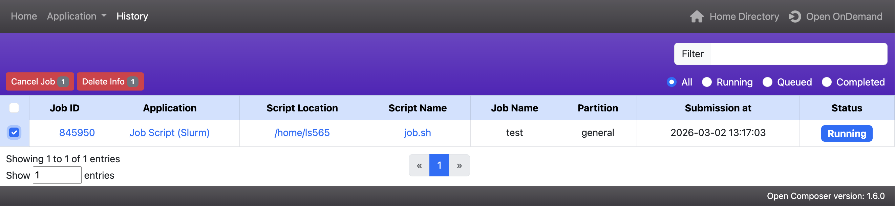

# Open Composer

{ width=100% height=100%}

**Open Composer** lets you create and submit custom Slurm jobs.

- Set job parameters (account, QoS, partition, walltime, cores, memory, etc.)

- Choose the script location, script name, and job name

- Edit the script content to add the commands they want to run

- Use **Advanced Options** to configure a job array

- Submit the job directly to Slurm  

## History Page

The **History** page shows submitted jobs and their current status.

{ width=100% height=100%}

- View job status (Running, Queued, Completed, etc.)

- **Cancel** — terminates the running Slurm job

- **Delete** — removes the entry from the History page only (does not delete job files)