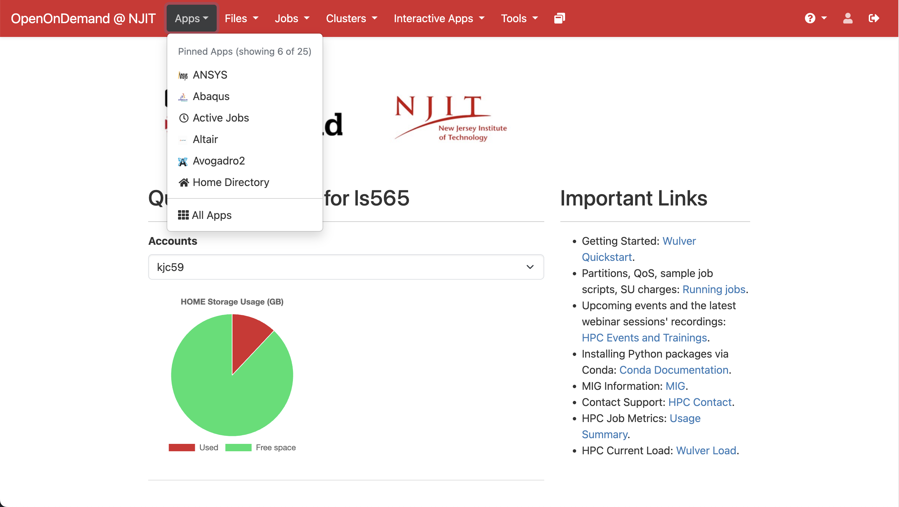
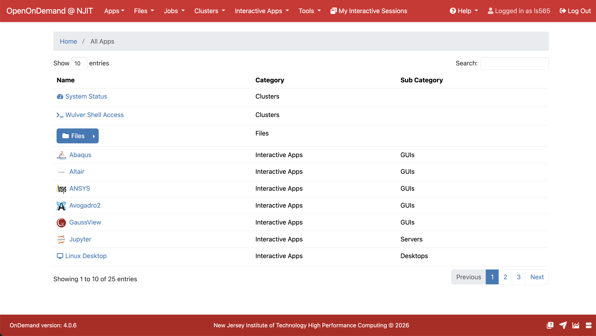

The Apps section in OpenOnDemand provides a centralized view of all available applications, tools, and features accessible through the web interface. It organizes cluster utilities, interactive applications, and file management tools in one place, making it easier to discover and launch resources without navigating multiple menus.

{ width=100% height=100%}

{ width=100% height=100%}