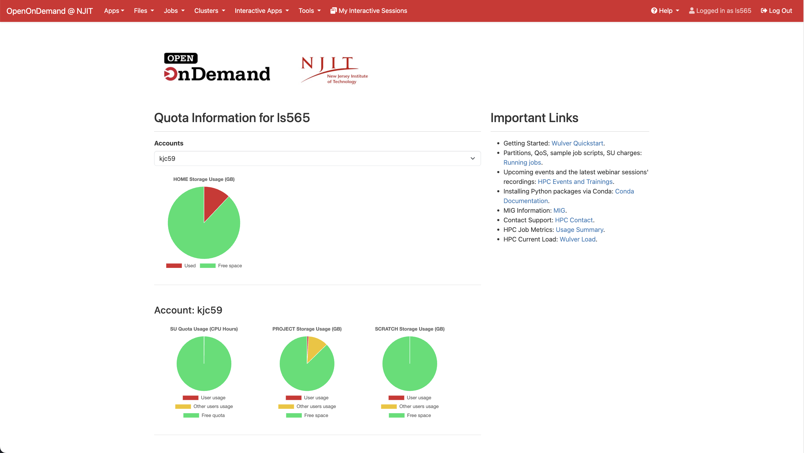
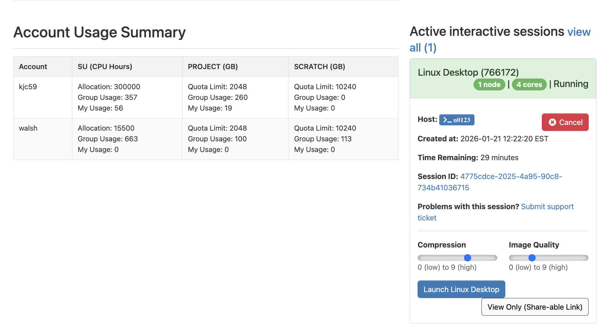
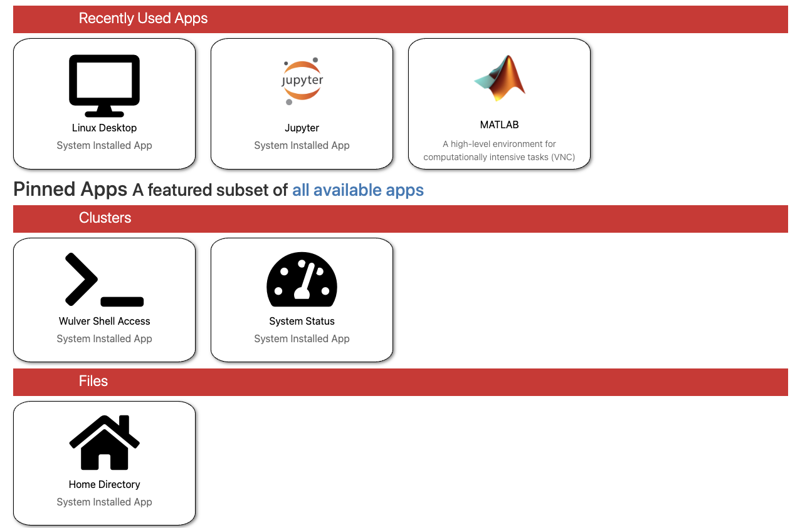
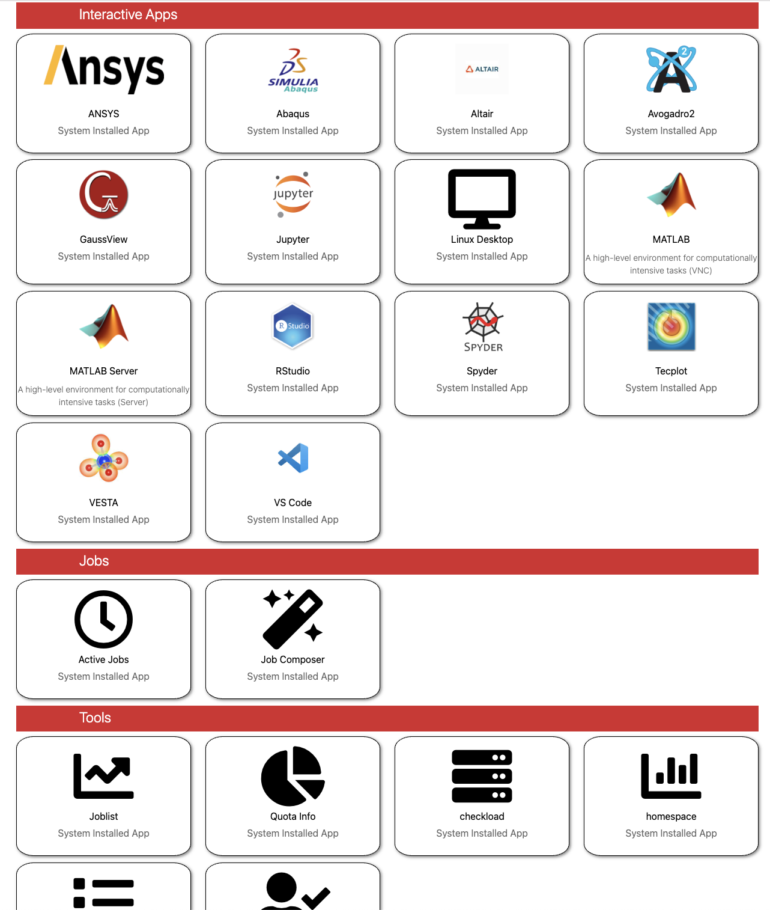

Our new dashboard provides you with a quick overview of your quota information and most used features.

If you’re associated with multiple accounts, select an account to view its quota details and storage usage, displayed in a pie chart.

{ width=100% height=100%}

You can also see your account usage in the table below the pie chart.

All active interactive sessions are listed directly on the dashboard, making them easy to view and manage.

{ width=100% height=100%}

We also provide a quick access to our most used features on the dashboard.

{ width=70% height=70%}

{ width=70% height=70%}