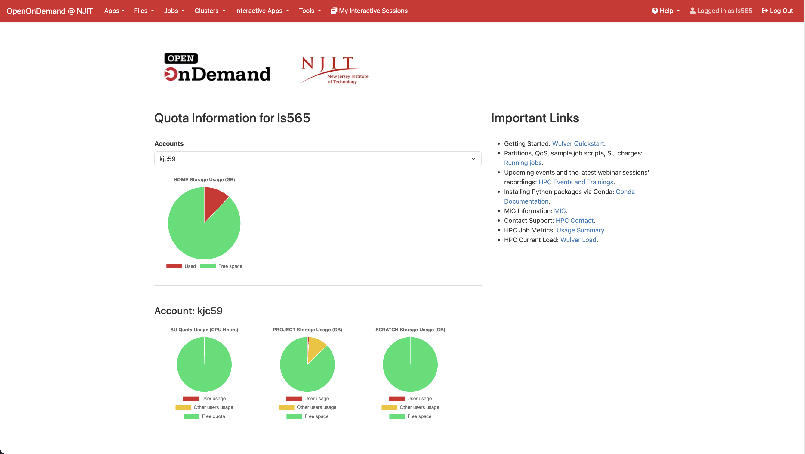

# Open OnDemand

## Overview

Open OnDemand is now available for NJIT HPC access at [ondemand.njit.edu](https://ondemand.njit.edu)!

[Open OnDemand](https://openondemand.org/) is a browser-based gateway to NJIT's Wulver cluster and shared storage. It offers a graphical interface allowing users to view, edit, download, and upload files. Users can manage and create job templates for the cluster and access interactive applications such as remote desktops to cluster nodes. Additionally, Open OnDemand supports GUI-based software like Jupyter Lab/Notebook, Matlab, and RStudio, all accessible through a web browser on virtually any device. No additional software installation is necessary, and users can operate with minimal Linux and job scheduler command knowledge.

This is an [open source](https://openondemand.org/) project developed through NSF funding.

## Features

* Easy to use
* Great for researchers and students new to HPC
* Convenient for experienced users as well

## Using OnDemand

### Logging into OnDemand

{ width=60% height=60%}

If you have access to the Wulver cluster, you can use OnDemand. Open any browser and go to ondemand.njit.edu. Use your UCID and password to log in. If you are off campus, you will need to set up VPN to access the platform.

### Dashboard

{ width=60% height=60%}

Once you log in, you will see the OnDemand Dashboard. You will see the menu bar on the top where you can access all the tools available including Files Manager, Shell Access, Job Composer, and Interactive Apps. You will also see several pinned apps highlighted on the Dashboard.

