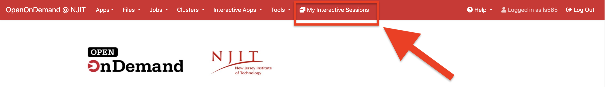
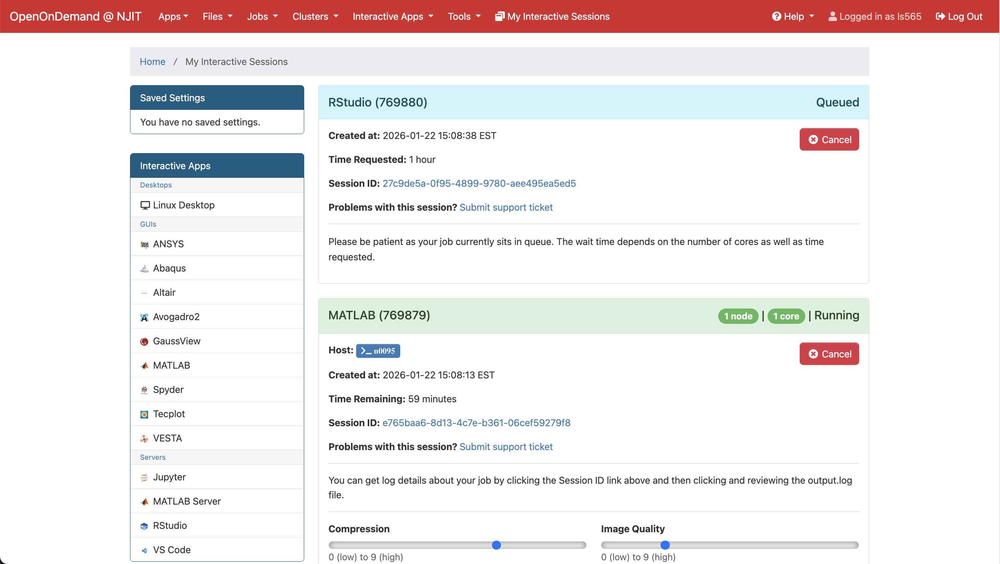
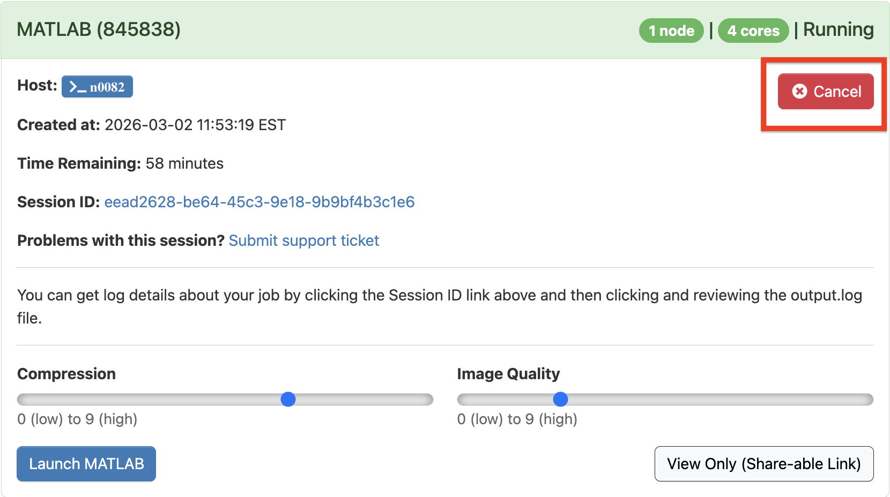
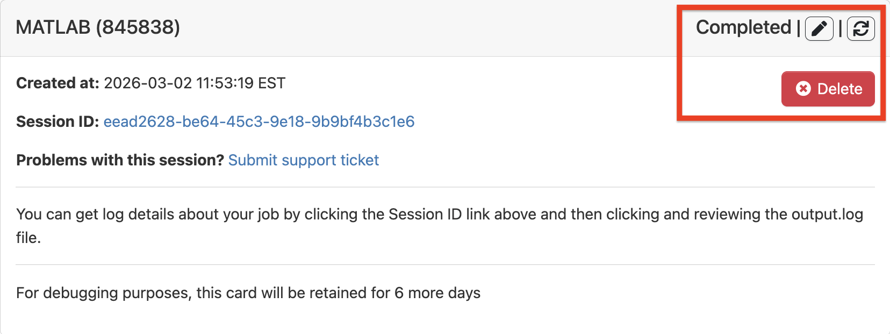

# My Interactive Sessions

## Overview

All of your active OnDemand sessions will be shown. 

{ width=100% height=100%}

{ width=100% height=100%}

## Canceling and Deleting Interactive Jobs

{ width=80% height=80%}

{ width=80% height=80%}

**Cancel** — Terminates the running Slurm job. The job card remains visible so you can **resubmit** the job with the same parameters or **modify** them before launching again.

**Delete** — Removes the job card from the dashboard.

If not deleted manually, completed job cards are automatically removed after 6 days.

!!! Warning

    Please don't forget to cancel all of your running sessions after use. Otherwise, they will keep consuming SU unless low priority is used.