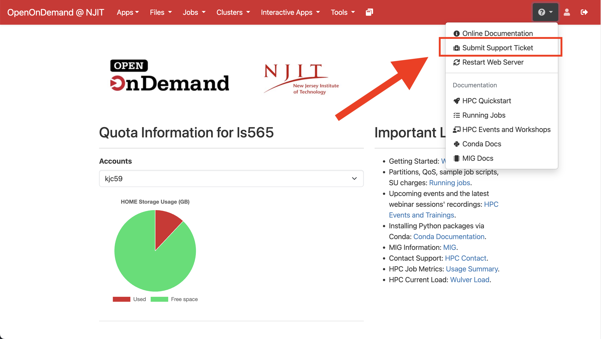
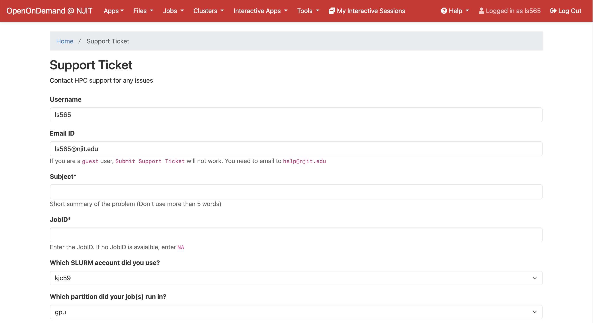
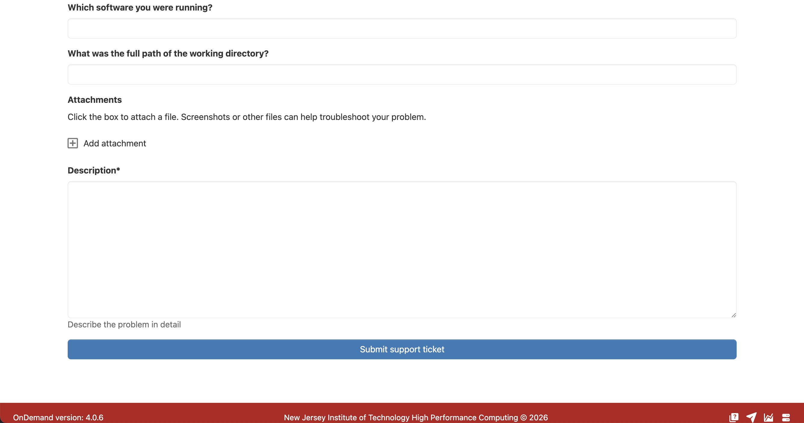
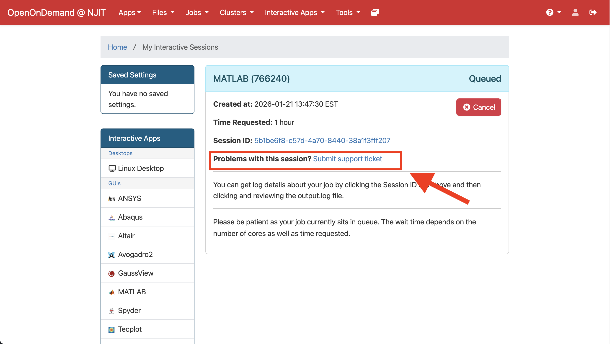

You can submit a ticket to HPC support team by selecting "Submit Support Ticket" button from the dropdown menu on navigation bar.

{ width=100% height=100%}

Fill in the form with all the necessary information specific to your issue and click on the Submit button. This will directly open a ticket in our system and our support team will get back to you as soon as possible.

{ width=100% height=100%}

{ width=100% height=100%}

!!! tip "Job specific ticket"
    You can also submit job specific ticket from you current interactive sessions.

{ width=100% height=100%}