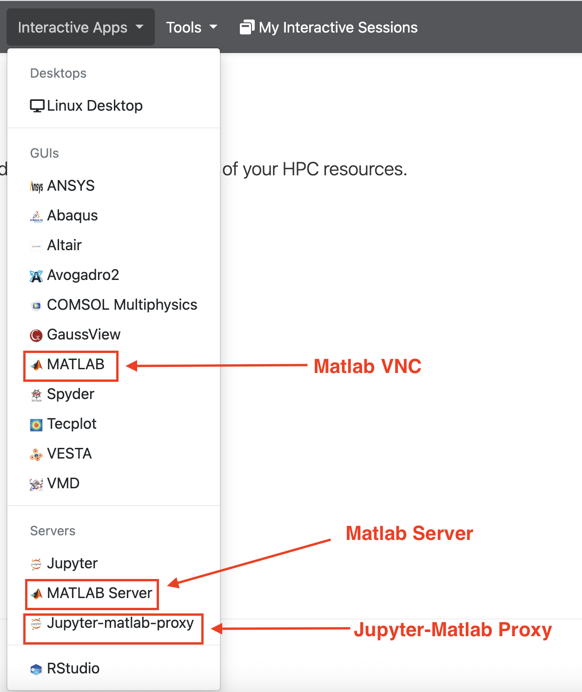
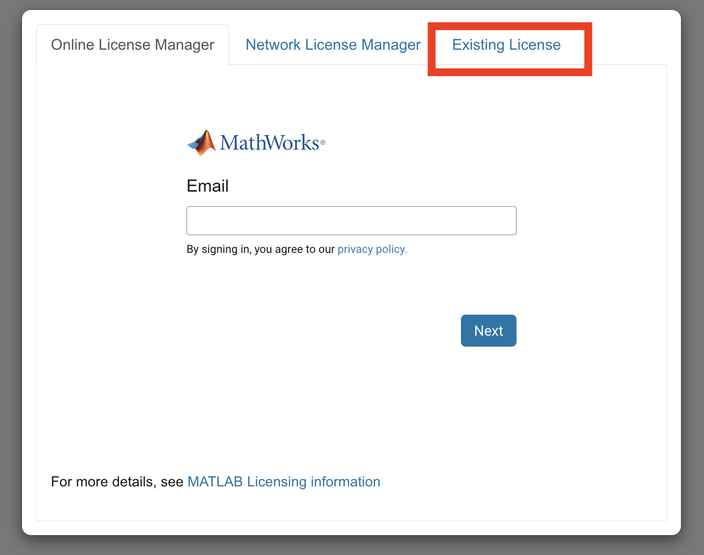
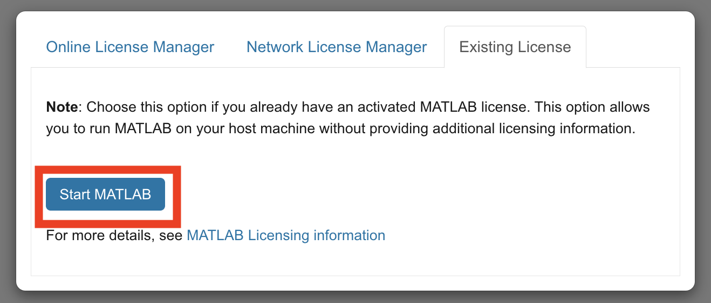
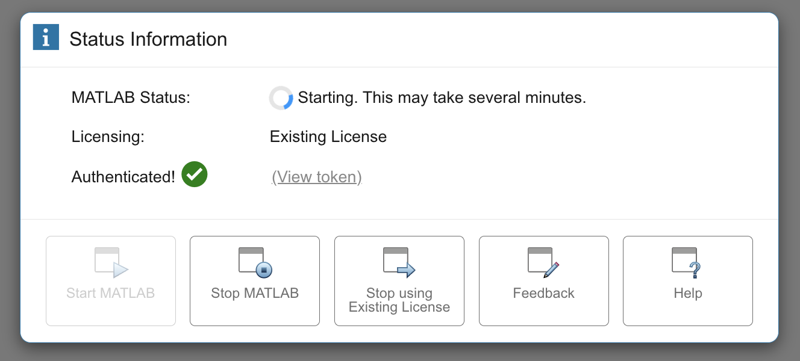

# MATLAB

## Overview

We have three different ways to connect Matlab: 

* Matlab VNC
* Matlab Server
* Jupyter Matlab Proxy

{ width=40% height=40%}

## Guide

=== "Matlab VNC"

    ## Launching MATLAB

    * Navigate to the Interactive Apps section.
    * Select `MATLAB` from the list of available applications.

    ## Loading the Matlab Version 

    * Select the dropdown option in `MATLAB Version`. The current versions installed on Wulver are `2023a` and `2024a`

    { width=60% height=60%}

    ## Configuring Resources

    * Specify your Slurm account/partition/qos.
    * Set the maximum wall time requested.
    * Choose the number of cores you need.
    * If required, specify the number of GPUs.

    { width=60% height=60%}

    { width=60% height=60%}

    { width=60% height=60%}

    ## Launching the Session

    * Select the `Launch` option after finalizing the resources. Once clicking **Launch**, the request will be queued, and when resources have been allocated, you will be presented with the option to connect to the session by clicking on the blue `Launch MATLAB` option.

    { width=60% height=60%}

    { width=60% height=60%}

    * You might see `Unable to contact settings server` message. It does not mean the Matlab session is terminated. You need to wait a few minutes to see the Matlab popup window.

    { width=60% height=60%}

    { width=60% height=60%}

    { width=60% height=60%}

=== "Matlab Server"

    *Same steps as matlab vnc upto launching the session*

    * Select existing License

    { width=60% height=60%}

    * Click start Matlab

    { width=60% height=60%}

    * Wait for couple minutes

    { width=60% height=60%}

    * Start working!!

=== "Jupyter Matlab Proxy"

    * Select matlab-proxy as conda env

    { width=80% height=80%}

    * Fill the rest of the form based on your desired configurations and click Launch. Wait for couple of seconds (same way as other matlab servers)
    * Once the Jupyter opens, click on Open Matlab

    { width=80% height=80%}

    * Then select existing license, wait for couple of minutes and matlab will start. *Same license steps as matlab server*

    * Start working!!

