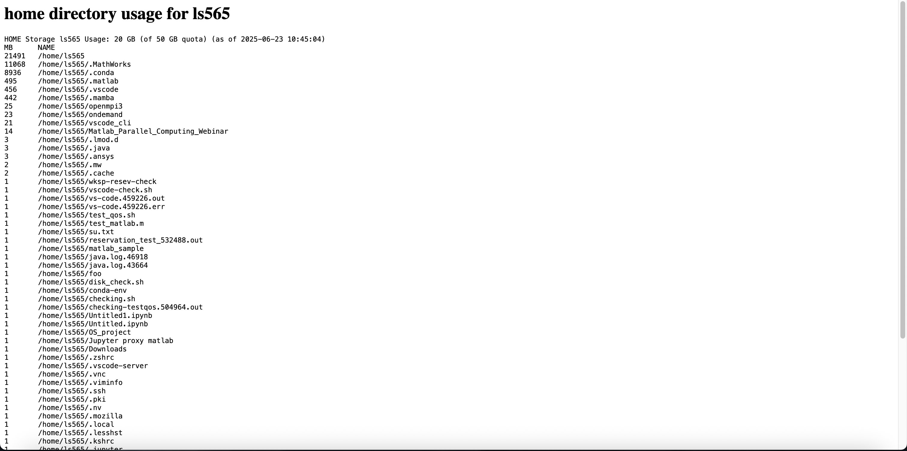

# Tools

## Overview

The passenger apps (Tools) on OnDemand are some of the easiest and user-friendly ways to monitor key stats related to your account and Wulver in general.

{ width=60% height=60%}

## Joblist

This is a simple tool to monitor your past jobs as well as the service units you have consumed in a given time period. To use this tool:

- Click on the Joblist option in the tools drop down menu.

- Enter the start date and end date between which you want to monitor your past jobs

{ width=60% height=60%}

- You will be presented with a table of your jobs with a few job details atop which you find information like service units consumed, your specified date range and the qos.

{ width=60% height=60%}

## Quota Info

Quota Info is a tool similar to the command “quota_info” on wulver. This tool allows you to see your account information. This information includes:

- All your accounts
- The total available SUs for each account
- The SUs consumed for each account
- Your storage information for each account for each partition `/project`, `/scratch`
- Your `/home` storage information

{ width=80% height=80%}

This is a very good tool for a quick look at your basic account information and is recommended to be used at least once or twice a month to check your SUs as well as `/home` storage. If you find your `/home `is reaching its upper limit you can use another tool called [homespace](#homespace) described below, to have a detailed look at your `/home` usage.

## Checkload

This is a tool which can be used to monitor the CPU load, state, and other parameters on compute nodes across the entire wulver cluster. This tool is not specific to your account.

- It can be used to check for idle nodes.
- It can also be used to cross check your requested configuration.
- It can also be crudely used to check the load on the cluster

{ width=80% height=80%}

## Homespace

This is one of the most useful tool to monitor your `/home` partition in detail. This gives you a list of subdirectories and their respective sizes (in MB). You should monitor your `/home` directory size at least twice a month depending on your usage to be sure you are below the upper limit of 50GB. Ideally you should clean your `/home` directory if it reaches 40GB or above. If your `/home` exceeds this limit it severely impacts some operations like creating new conda envs, installing new packages, etc.

Also an easy way to keep your `/home` below this limit is to move your conda environment and package default directory to your `/project` directory, the details for this can be found [here](../Software/programming/python/conda.md#export-conda-environment)

!!! Note

    Since it calculates the storage used by each subdirectory and file in your `/home` directory, it may take some time to load the results.

{ width=80% height=80%}

## PS

This is also a very important tool to monitor processes running on your login node usage. 

{ width=80% height=80%}

!!! Warning
    It is strictly advised to not run any resource consuming process on the login node, instead use compute node. The login node is shared between all the wulver users. Using login node for any such process like creating conda env, installing conda packages, running your jobs/programs is strictly not advised. Repeatedly using the login node for such processes will result in strict action. If you find there is high activity by any process on your login node and you are unsure of the cause please email to [hpc@njit.edu](mailto:hpc@njit.edu) with the screenshot of the output of the PS tool.

## Qoslist

QOS is an important flag for any type of job submission. You can check all the available QOS for each of your accounts using this tool. Click [here](../Software/slurm/slurm.md#partition-use-partition) for details about QOS.

{ width=80% height=80%}