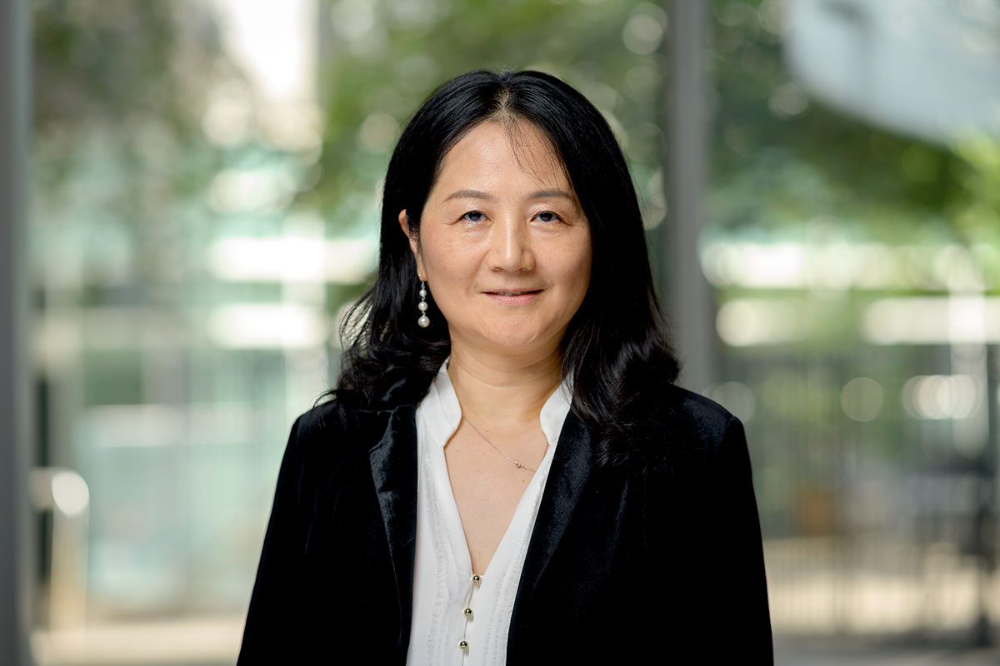

---
hide:
  - toc
---

# ARCS Leadership

|                             Name                             |                         Title                         |     Phone      |           Email           |  Office   |
|:------------------------------------------------------------:|:-----------------------------------------------------:|:--------------:|:-------------------------:|:---------:|
|  [Alex Pacheco](#associate-cio-advanced-research-computing)  |      Associate CIO - Advanced Research Computing      | (973) 596-2672 |   alex.pacheco@njit.edu   | GITC 5401 |
| [Kate Cahill](#director-high-performance-research-computing) |     Director, High Performance Research Computing     | (973) 596-2721 | katharine.cahill@njit.edu | GITC 2203 |
|                 [Kevin Walsh](#assistant-director-advanced-computing-infrastructure)                  | Assistant Director, Advanced Computing Infrastructure | (973) 596-5747 |      walsh@njit.edu       | GITC 2202 | |

# High Performance Research Computing

|                                 Name                                 |                         Title                         |     Phone      |            Email            |   Office   |
|:--------------------------------------------------------------------:|:-----------------------------------------------------:|:--------------:|:---------------------------:|:----------:|
|     [Kate Cahill](#director-high-performance-research-computing)     |     Director, High Performance Research Computing     | (973) 596-2721 |      gwolosh@njit.edu       | GITC 2203  |
| [Kevin Walsh](#assistant-director-advanced-computing-infrastructure) | Assistant Director, Advanced Computing Infrastructure | (973) 596-5747 |       walsh@njit.edu        | GITC 2202  |
|      [Hui(Julia) Zhao](#senior-research-computing-facilitator)       |            Research Computing Facilitator             | (973) 596-2727 |      hui.zhao@njit.edu      | GITC 2316B |
|        [Abhishek Mukherjee](#research-computing-facilitator)         |            Research Computing Facilitator             | (973) 642-4132 | abhishek.mukherjee@njit.edu | GITC 2316B |

# Research and Academic Technologies

|    Name     |                  Title                   |     Phone      |      Email      |  Office   |
|:-----------:|:----------------------------------------:|:--------------:|:---------------:|:---------:|
| Rick Gaine  | Research Technology System Administrator | (973) 596-5441 | rgaine@njit.edu | GITC 2404 |
| Charles Yan |  Research Technology Support Specialist  | (973) 596-2907 |  cyan@njit.edu  | GITC 2301 |

-   # Associate CIO, Advanced Research Computing
    

    { style="width:220px; height:200px;" }
    <h4><b>Alex Pacheco</b></h4>
    

    ---
    Alex Pacheco joined NJIT on August 2, 2022, as the Associate CIO for Advanced Research Computing. He brings over twenty years of combined experience as an HPC user, user support consultant, and manager of HPC resources. At Lehigh University, he helped develop a strategic vision for a shared HPC resource and served as a co-PI on an NSF Campus Cyberinfrastructure award.
    <a href="https://github.com/alexpacheco">{ width="15" }</a>
    <a href="https://www.linkedin.com/in/abpacheco">{ width="15" }</a>

-

-   # Director, High Performance Research Computing

    

    { style="width:200px; height:200px;" }
    <h4><b>Kate Cahill</b></h4>
    

    ---
    Kate started at NJIT in September 2023. Previously, she was the Education & Training Specialist at the Ohio Supercomputer Center for 8 years, where she led the training programs for OSC as well as external education programs related to HPC and computational science for the XSEDE project as well as other grant-funded efforts.

-   # Assistant Director, Advanced Computing Infrastructure

    Kevin Walsh is the Assistant Director of Research Computing Infrastructure at New Jersey Institute of Technology. With an extensive experience in managing high-performance computing environments, Kevin leads the design, deployment, and support of computational services crucial to cutting-edge research. Known for his collaborative approach, he works closely with faculty, IT teams, and external partners to ensure reliable, scalable infrastructure that accelerates discovery and innovation.
    <a href="https://www.linkedin.com/in/kevin-walsh-computes">{ width="15" }</a>

# HPC consultation

-   ## Research Computing Facilitator

    

    { style="width:280px; height:200px;" }
    <h4><b>Hui(Julia) Zhao</b></h4>
    

    ---
    Hui(Julia) joined NJIT in December 2023, following twenty years in a similar role at Memorial Sloan Kettering Cancer Center. Julia's experience includes roles as a Bioinformatician, Unix System Administrator and High Performance Computing Engineer, with expertise in system and application configuration and user support. She helps user apply high-performance computing techniques to address diverse challenges in scientific computing.

-   ## Research Computing Facilitator   

    

    { style="width:200px; height:200px;" }
    <h4><b>Abhishek Mukherjee</b></h4>
    

    ---
    Abhishek Mukherjee is a computational scientist and has experience in multidisciplinary projects, providing engineering solutions for computational fluid dynamics problems. He has expertise in HPC software installation and is an active contributor to EasyBuild that allows to manage software on HPC systems in an efficient way.
    <a href="https://github.com/absrocks">{ width="15" }</a>
    <a href="https://www.linkedin.com/in/absrocks">{ width="15" }</a>
    
    You can schedule appointments with Abhishek from this [link](https://calendly.com/abhinjit/arcs-hpc) to consult on problems or questions you are encountering related to your work using the high-performance computing and big data resources at NJIT. Please, before making appointments with [Abhishek Mukherjee](#abhishek-mukherjee), send your query to [hpc@njit.edu](mailto:hpc@njit.edu), so that an incident number will be created which is required to schedule an appointment. 

## HPC Student Interns

-   ### 
    

    { style="width:150px; height:200px;" }
    <h4><b>Lakshya Saharan</b></h4>
    

    ---
    Lakshya Saharan began his Master’s in Computer Science and joined NJIT’s High Performance Computing (HPC) department as a student intern on September 24. He provides assistance to researchers and students with effective utilization of the cluster, contributes to essential technical documentation, and supports ongoing operational tasks to ensure the cluster's smooth and efficient performance.<a href="https://github.com/Lakshyasaharan5">{ width="15" }</a>
    <a href="https://www.linkedin.com/in/lakshya-saharan-8567611b1/">{ width="15" }</a>

-   ###   

    

    { style="width:150px; height:200px;" }
    <h4><b>Aakash Singh</b></h4>
    

    ---
    Aakash Singh is a CKA certified DevOps and SRE professional with extensive experience in cloud infrastructure optimization (AWS, Azure) and Kubernetes administration. He has a strong record of enhancing system reliability and achieving significant operational cost reductions.. Aakash excels in designing and managing high-availability, scalable systems, including GPU-accelerated infrastructure for AI/ML workloads and MLOps. His expertise encompasses CI/CD automation, platform engineering, and performance benchmarking of GPUs (e.g., A100s). With deep Linux knowledge, Aakash currently works as an HPC Support Specialist, focusing on AI/ML platforms and contributing to the efficiency of distributed systems. He is keen to leverage his skills in cutting-edge AI and HPC environments.<a href="https://github.com/Frex22">{ width="15" }</a>
    <a href="www.linkedin.com/in/aakash-singh-b49684217">{ width="15" }</a> 

# Former staff and students

## Gedaliah Wolosh

{ align=left, width="300" }

Dr. Wolosh had been at NJIT for over twenty years working in research computing. He was the lead architect for all the HPC resources at NJIT. He specialized in building scientific software stacks.
<a href="https://github.com/gwolosh">{ width="15" }</a>
<a href="https://www.linkedin.com/in/gwolosh">{ width="15" }</a>

