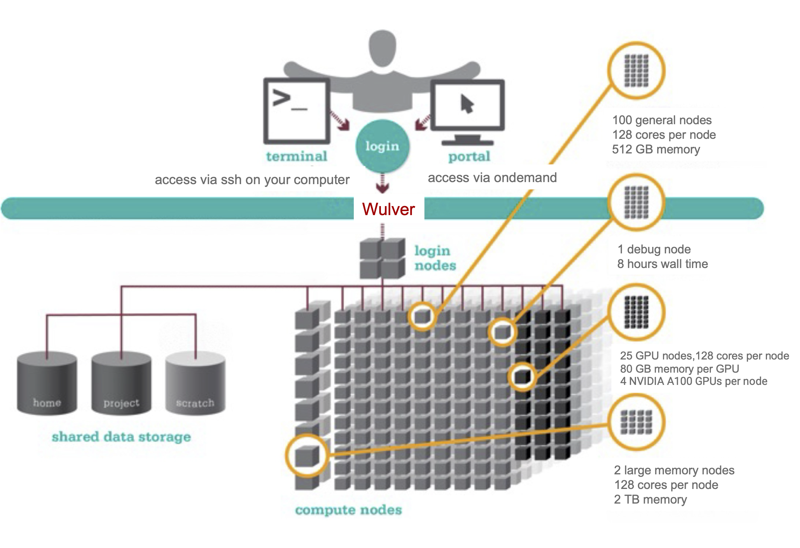

# Current cluster

* [Wulver](wulver.md) is NJIT's newest High Performance Cluster made available to users in Jan 2024.

{ width=80% height=80%}

-   ## Virtual Tour of NJIT Data Center

    ---

    Wulver is built through a partnership with [DataBank](https://www.databank.com/), which is live in DataBank’s Piscataway, N.J. data center (EWR2) and will support NJIT’s research efforts. This infrastructure will bolster NJIT’s research initiatives. You can access the 3D virtual tour of HPC data center below:

    <iframe width='600' height='400' src='https://my.matterport.com/show/?m=KgYz67s8YoM' frameborder='0' allowfullscreen allow='xr-spatial-tracking'></iframe>

